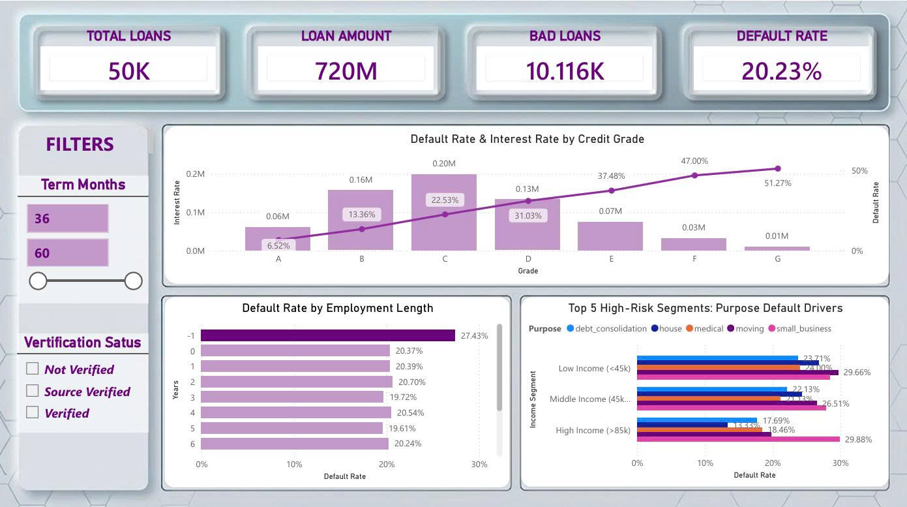
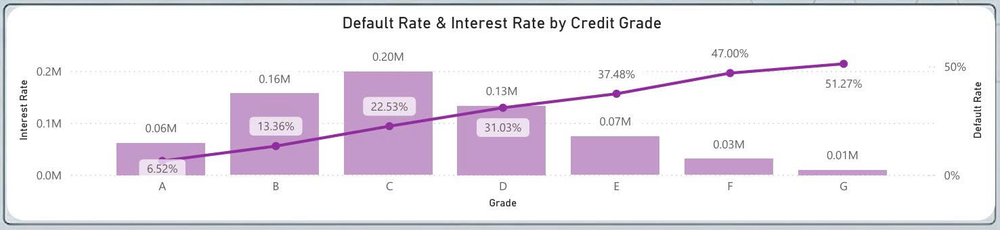
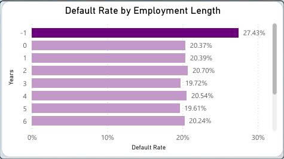
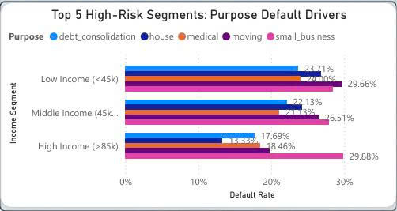

# Credit-Risk-Analysis
An end-to-end data pipeline analyzing peer-to-peer lending risk to evaluate FinTech underwriting and credit scoring models.

# 📊 FinTech Credit Risk Analysis: End-to-End Data Pipeline & Risk-Based Pricing Evaluation

## 1. Business Context & Objective
In the digital finance era, **FinTech P2P Lending** platforms are bridging the credit gap left by traditional commercial banks by offering flexible underwriting. However, this flexibility comes with substantially higher Default Risk.

This project builds an **End-to-End Data Pipeline** to analyze a portfolio of **50,000 loan records**. The core objective is to decode the **Risk-based Pricing** mechanisms of FinTech lending and uncover "blind spots" caused by information asymmetry, ultimately optimizing the credit underwriting model.

## 2. Tech Stack & Data Pipeline
* **Python (Data Engineering):** Handled the raw 1.2GB dataset. Applied memory-optimized Random Sampling to extract a representative subset of 50,000 rows.
* **SQL Server (Data Modeling):** Standardized data via `SQL Views`. Converted textual employment lengths into integers, handled NULL values, and utilized **CTEs / Window Functions** to rank high-risk segments.
* **Power BI (Business Intelligence):** Developed a robust Star Schema, created dynamic DAX measures for calculating Default Rates, and built an interactive dashboard for multi-dimensional risk slicing.

## 3. Interactive Dashboard
Portfolio Overview: **50K Loans**, Total Funded Amount **$720M**, Overall Default Rate **20.23%**.

## 4. Key Insights & Storytelling

### 📌 Insight 1: The Effectiveness of Risk-Based Pricing
Unlike traditional banks that outright reject subprime applicants, FinTech absorbs the risk but heavily compensates through interest rate adjustments.

* **Finding:** A perfect positive correlation exists between Credit Grade and Default Rate. Grade A borrowers default at only **6.52%**, whereas Grade G skyrockets to **51.27%**.
* **Business Impact:** To offset the reality that 1 in 2 Grade G borrowers will default, the algorithm correctly assigns the highest interest rate ceiling. This proves the internal credit scoring model is functioning accurately as a pricing tool.

### 📌 Insight 2: Data Blind Spots and Adverse Selection
Information asymmetry is the biggest threat in unsecured lending.

* **Finding:** Borrowers with undisclosed/unknown employment lengths (-1) exhibit a drastically higher default rate of **27.43%**, far exceeding the 19-20% average of those with verified tenure.
* **Business Impact:** Missing data here is a behavioral red flag, not just a technical error. Financially unstable applicants actively withhold information—a classic case of Adverse Selection.

### 📌 Insight 3: The Toxic Segment - Small Business Loans
High personal income does not guarantee repayment if the loan purpose is inherently volatile.

* **Finding:** "Small Business" loans are the leading driver of defaults across all income brackets (ranging from 26.51% to nearly **30%**). Surprisingly, even high-income borrowers (>85k) seeking small business loans have a higher default rate (29.88%) than low-income borrowers taking out personal loans.
* **Business Impact:** The cash flow of micro-businesses is highly susceptible to macro-economic shocks, making it the most toxic asset class in an unsecured lending portfolio.

## 5. Strategic Recommendations
1. **Mitigate "Unknown" Risk:** Mandate advanced eKYC or integrate Alternative Data (social footprint, utility bills) for applicants lacking employment history. Alternatively, apply an "Information Risk Premium" to their interest rates.
2. **Tighten Small Business Credit Limits:** Shift from lump-sum funding to milestone-based disbursements for small business loans to strictly monitor actual capital utilization and limit exposure.
3. ---
 

## 1. Bối cảnh Dự án & Mục tiêu Kinh doanh (Business Context)
Trong kỷ nguyên tài chính số, các nền tảng **FinTech Lending (Cho vay ngang hàng - P2P)** đang lấp đầy khoảng trống mà các Ngân hàng Thương mại (NHTM) truyền thống bỏ lại bằng cách phê duyệt tín dụng linh hoạt. Tuy nhiên, sự linh hoạt này đi kèm với rủi ro vỡ nợ (Default Risk) cực kỳ cao.

Dự án này xây dựng một **Data Pipeline toàn diện** phân tích danh mục **50,000 hồ sơ vay**, nhằm giải mã cơ chế **Định giá theo rủi ro (Risk-based Pricing)** của FinTech, đồng thời bóc tách các "điểm mù" về bất đối xứng thông tin để tối ưu hóa mô hình thẩm định (Underwriting Model).

## 2. Kiến trúc Kỹ thuật (Tech Stack & Data Pipeline)
Quy trình được thiết kế tối ưu để xử lý tập dữ liệu lớn và trích xuất Insight chuẩn xác:
* **Python (Data Engineering):** Xử lý tập dữ liệu thô (1.2GB Big Data). Áp dụng Random Sampling để trích xuất tập mẫu 50,000 dòng, đảm bảo tính đại diện và tối ưu hóa bộ nhớ xử lý.
* **SQL Server (Data Modeling & Transformation):** Xây dựng `SQL Views` để chuẩn hóa dữ liệu. Chuyển đổi dữ liệu text thành numeric (`emp_length`), xử lý Missing Values, và sử dụng **Window Functions / CTEs** để xếp hạng phân khúc rủi ro.
* **Power BI (Visualization & DAX):** Thiết lập Star Schema, viết DAX Measures động tính toán Tỷ lệ nợ xấu (`Default Rate`), và xây dựng Dashboard tương tác giúp người dùng đào sâu vào từng lát cắt rủi ro.

## 3. Hệ thống Báo cáo Trực quan (Interactive Dashboard)
Tổng quan danh mục: **50K khoản vay**, Tổng dư nợ **720 Triệu USD**, Tỷ lệ nợ xấu toàn danh mục ở mức **20.23%**.

## 4. Phân tích Chuyên sâu (Key Insights & Storytelling)

### 📌 Insight 1: Hiệu quả của cơ chế "Định giá theo rủi ro" (Risk-Based Pricing)
Không giống như NHTM truyền thống thường từ chối thẳng thừng hồ sơ dưới chuẩn, FinTech chấp nhận rủi ro nhưng bù đắp bằng lãi suất.

* **Phân tích:** Biểu đồ thể hiện sự tương quan dương hoàn hảo giữa Hạng tín dụng (Grade) và Tỷ lệ nợ xấu. Nhóm rủi ro thấp (Grade A) có tỷ lệ nợ xấu chỉ **6.52%**, trong khi nhóm đáy (Grade G) vọt lên tới **51.27%**. 
* **Business Impact:** Để bù đắp việc "cứ 2 người vay thì 1 người quỵt nợ" ở nhóm G, hệ thống đã tự động áp mức lãi suất trần rất cao. Điều này chứng minh thuật toán chấm điểm tín dụng nội bộ của nền tảng đang hoạt động đúng hướng.

### 📌 Insight 2: "Điểm mù" dữ liệu và Hành vi Lựa chọn nghịch (Adverse Selection)
Bất đối xứng thông tin là kẻ thù lớn nhất của tín dụng không tài sản đảm bảo.

* **Phát hiện:** Nhóm khách hàng không xác định được thâm niên làm việc (Unknown / -1) có tỷ lệ nợ xấu cao đột biến lên tới **27.43%**, vượt xa mức trung bình 19-20% của các nhóm có khai báo thâm niên.
* **Business Impact:** Việc thiếu dữ liệu không đơn thuần là lỗi hệ thống. Khách hàng có tài chính bất ổn thường có xu hướng chủ động che giấu thông tin. Đây là tín hiệu cảnh báo đỏ cho hành vi lựa chọn nghịch.

### 📌 Insight 3: Phân khúc độc hại - Bức tranh đằng sau "Kinh doanh nhỏ"
Thu nhập cá nhân cao không đồng nghĩa với khả năng trả nợ tốt nếu mục đích vay mang tính rủi ro kinh doanh.

* **Phát hiện:** Vay để "Kinh doanh nhỏ" (Small Business) là mục đích dẫn đầu về tỷ lệ vỡ nợ ở mọi phân khúc thu nhập (dao động từ 26.51% đến xấp xỉ **30%**). Đáng chú ý, ngay cả nhóm có thu nhập cao (>85k) đi vay kinh doanh nhỏ cũng có tỷ lệ nợ xấu (29.88%) cao hơn hẳn nhóm thu nhập thấp đi vay tiêu dùng.
* **Business Impact:** Dòng tiền kinh doanh nhỏ lẻ rất dễ đứt gãy trước các biến động vĩ mô, khiến nó trở thành loại tài sản "độc hại" nhất trong danh mục cho vay tín chấp.

## 5. Khuyến nghị Giải pháp (Strategic Recommendations)
1. **Quản trị nhóm "Unknown":** Yêu cầu bắt buộc eKYC chuyên sâu hoặc quét dữ liệu thay thế (Alternative Data) từ mạng xã hội/hóa đơn tiện ích đối với nhóm không có lịch sử việc làm. Nếu không, cần áp dụng thêm "Phí rủi ro thông tin" (Information Risk Premium).
2. **Siết chặt room tín dụng Kinh doanh nhỏ:** Áp dụng mô hình giải ngân theo từng giai đoạn (Milestone-based) thay vì cấp vốn một lần cho mục đích Small Business để kiểm soát mục đích sử dụng vốn thực tế.

*Thực hiện bởi: **Bùi Thị Phước Trâm** - Data Analyst / Business Analyst Portfolio*
